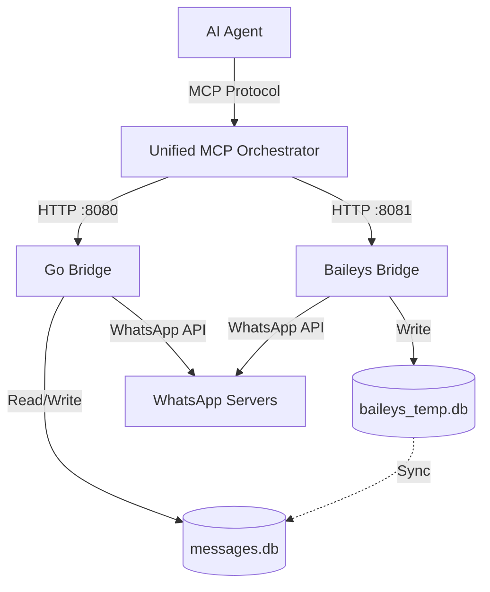

# Architecture Diagrams

## System Overview (ASCII)

```
┌─────────────────────────────────────────────────┐
│       AI Agent (Claude, Cursor, etc.)           │
└────────────────────┬────────────────────────────┘
                     │ MCP Protocol (stdio)
┌────────────────────▼────────────────────────────┐
│         Unified MCP Orchestrator (Python)       │
│  - Intelligent request routing                  │
│  - Database synchronization                     │
│  - Unified tool interface (75 tools)            │
└─────────┬──────────────────────┬────────────────┘
          │                      │
          │ HTTP :8080           │ HTTP :8081
          │                      │
┌─────────▼─────────┐   ┌────────▼──────────────┐
│   Go Bridge       │   │  Baileys Bridge       │
│   (whatsmeow)     │   │  (TypeScript/Node.js) │
│                   │   │                       │
│ ✓ Communities     │   │ ✓ History Sync        │
│ ✓ Mark as read    │   │ ✓ Auto message        │
│ ✓ Media ops       │   │   capture             │
│ ✓ Send messages   │   │                       │
└─────────┬─────────┘   └────────┬──────────────┘
          │                      │
          │ SQLite               │ SQLite (temp)
┌─────────▼─────────┐   ┌────────▼──────────────┐
│   messages.db     │◄──┤  baileys_temp.db      │
│   (Go schema)     │sync│  (Baileys schema)    │
│ SINGLE SOURCE     │   │  Temporary storage    │
│ OF TRUTH          │   │  for history sync     │
└───────────────────┘   └───────────────────────┘
```

## Mermaid Diagram



## Operation Flows

### Go-Only Operation (e.g., Send Message)
```
AI Agent → Unified MCP → Go Bridge → WhatsApp → messages.db
```

### Baileys-Only Operation (e.g., Retrieve Full History)
```
AI Agent → Unified MCP → Baileys Bridge → WhatsApp → baileys_temp.db
```

### Hybrid Operation (e.g., Mark Community As Read with History)
```
AI Agent → Unified MCP → Baileys Bridge → baileys_temp.db
                      ↓
                   Sync Process
                      ↓
           Go Bridge → messages.db → Mark as Read → WhatsApp
```
